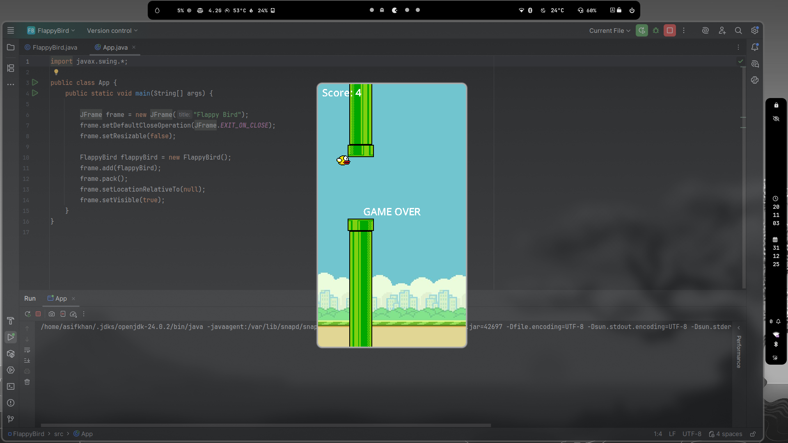

# FlappyBird
# 🐦 Flappy Bird – Java Swing Game

A simple **Flappy Bird clone** built using **Java Swing**.  
This project demonstrates core **Java OOP concepts**, **event handling**, **graphics rendering**, and **game mechanics** such as gravity, collision detection, and scoring.

---

## 📸 Game Screenshot



> Screenshot captured during gameplay showing score tracking and game-over state.

---

## 🎮 Game Features

- Smooth 2D gameplay using Java Swing
- Gravity-based bird movement
- Randomly generated pipes
- Collision detection
- Score tracking
- Game restart on key press
- Fixed frame rate (60 FPS)

---

## 🛠️ Technologies Used

- **Java**
- **Java Swing (JFrame, JPanel)**
- **AWT (Graphics, Image)**
- **Object-Oriented Programming**
- **Event Handling (KeyListener, Timer)**

---

## 🕹️ Controls

| Key | Action |
|-----|--------|
| Space Bar | Make the bird jump |
| Space (after Game Over) | Restart the game |

---

## 📁 Project Structure

FlappyBird/
│
├── App.java // Main class (Entry point)
├── FlappyBird.java // Game logic & rendering
├── flappybird.png // Bird image
├── flappybirdbg.png // Background image
├── toppipe.png // Top pipe image
├── bottompipe.png // Bottom pipe image
└── screenshot.png // Gameplay screenshot


---

## ▶️ How to Run the Game

### Method 1: Using Terminal
```bash
javac App.java
java App


### Method 2: Using an IDE

1. Open the project in IntelliJ IDEA / Eclipse / VS Code

2. Run App.java

3. Press Space Bar to start playing


📚 Concepts Demonstrated

Game loop using javax.swing.Timer

Gravity and velocity mechanics

Collision detection using Rectangle

Keyboard input handling

Rendering images using Graphics

Object-oriented design principles


🚀 Future Enhancements

Sound effects

High score system

Start menu & pause feature

Bird animation

Difficulty levels


👨‍💻 Author

Asif Khan
BCA Student | Java Developer
Passionate about game development and problem solving


